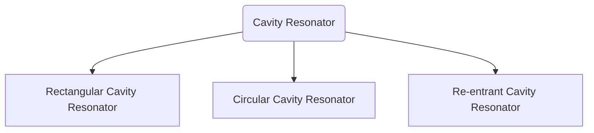

# Micro Wave and Antenas

> [!multi-column]
>
> > [!info]+ Module 1
> > Basic antenna parameters:
> >
> > - gain
> > - directivity,
> > - beam width
> > - and effective aperture calculations,
> > - effective height,
> > - wave polarization,
> > - radiation resistance,
> > - radiation efficiency,
> > - antenna field zones.
> > - Duality and Principles of reciprocity,
> > - Helmholtz theorem (derivation required),
> > - Field, directivity and radiation resistance of a short dipole and half wave dipole (far field derivation).
>
> > [!info]+ Module 5
> > **Microwaves:**
> >
> > - Introduction,
> > - Advantages,
> > - Cavity Resonators
> > - Derivation of resonance frequency of Rectangular cavity.
> >   Single cavity klystron
> > - Reflex Klystron Oscillators:
> >   - Derivation of Power output,
> >   - efficiency and admittance.
> > - Magnetron oscillators:
> >   - Cylindrical magnetron,
> >   - Cyclotron angular frequency,
> >   - Power output and efficiency.
> > - Travelling Wave Tube:
> >   - Slow wave structures,
> >   - Helix TWT,
> >   - Amplification process,
> >   - Derivation of convection current,
> >   - axialelectric field,
> >   - wave modes and gain.
## Classes
1. [[#Resonator|07.08.2024 9:05AM]]

##### Types of antenas

1. Isotropic Antenas
2. Omnidirectional Antena
3. Directive antenas

## Module 2

#### Resonator
- Used in LC and L and C circuits -> Tuned Circuits and and Oscillators, amplifiers and filters etc..
- Absorbs maximum power when the frequencies are matched -> which is used in [[|lab Experiment]] to determine the frequencies
- At tuned frequencies ($f=f_r$) the **impedance** is real.
- also at resonant frequency ($f = f_r$)
  $$
  Total \ Energy = 2 \times Energy \ Stored \ In \ Resonator
  $$

##### Cavity Resonator 
A length of waveguide (either rectangular,cylindrical or coaxial) shorted at both the ends forms a [[#Resonator]] and it is often called a **Cavity Resonator**

---

- The ==stored electric and magnetic energies inside the resonator decides the equivalent impedance and capacitance== while the ==energy dissipated due to finite conductivity of the cavity walls determine the equivalent resistance of the resonator==[^1]

- The microwave cavities resonates at discrete frequencies called **"Modes of resonance"** 
##### Q factor
The cavity resonator can be also classified according to **Q factor** or **Quality Factor**

- How much energy can it store depends on Q factor.
- Which defines the sharpness of resonance

#### Rectangular Cavity Resonator

![[rectangular waveguide.excalidraw]]

$m,n,p$ -> No of half cycles along the direction $x,y,z$

$$
k = kx^{2}+ ky^{2}+ kz^2
$$

## References

[^1]: Chapter 4 , Mircowave Devices and Applications , Dinesh C Dube
