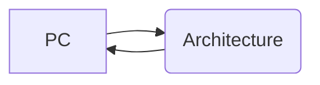

# Architecture design
#### Instruction Execution

The flow diagram shows a simple Instruction Execution 
- **Program Counter(PC):**  It Stores the address of the instruction which is to be executed ,and the processor uses this **address** to fetch the instruction form the  **Memory** 
- **Decoding :** Here the instruction is get decodes to a format that the computer can understand(zeros and ones 01001)
- **Executing:** In normal old computers after decoding the instruction gets excecuted
- **Memory Access:** If the instruction includes memory access the processor will access the corresponding location.
- **Write Back:** After finishing the execution the result will get written to appropriate location . It could be a **Registor** or **Memory**
  

#### Critical Path
*The critical path for an instruction is the most time consuming path through the architecture for that instruction*
Most instructions starts from **Program Counter(PC)** then to process through architecture and 

## Contents
- 